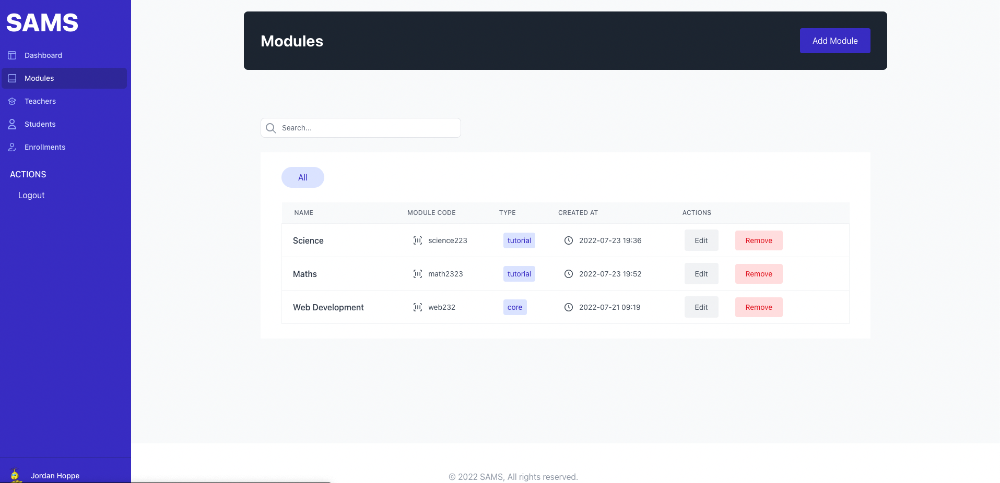
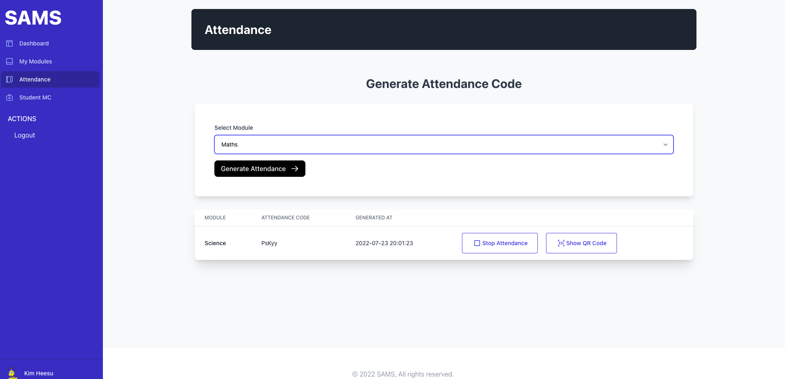
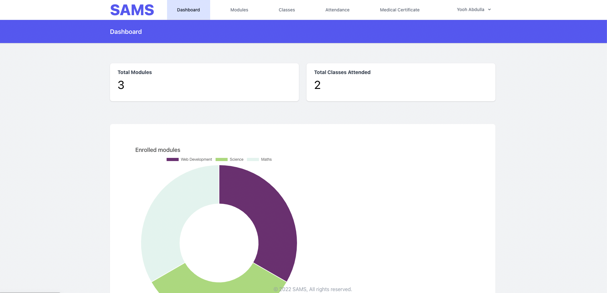
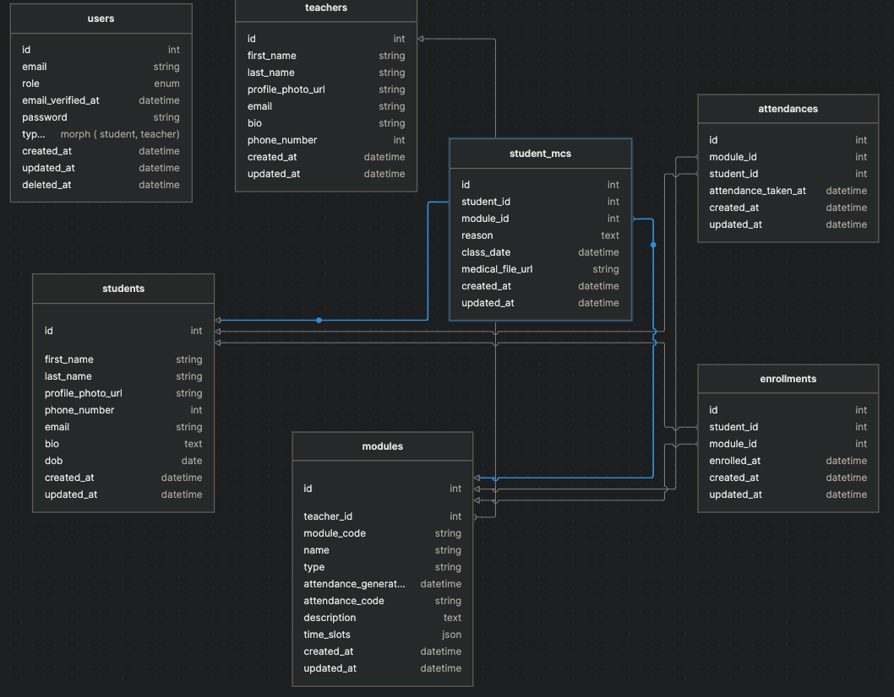

# SAMS

Student Attendance Management System ( Part of the web dev competition & assignment at taylors)









Hosted Live Version At: https://sams.jinas.me


## Steps to run the application 

Clone the repo

```bash
composer install
```

```bash

cp .env.example .env
```

```
Setup migrations


php artisan migrate
```
```bash
npm i
```

```bash
npm run dev
```

Run the app

```bash
php artisan serve
```


## Todo

- [x] Simple Landing Pages ( Kim )
- [x] Connect Dashboard Charts to backend ( Kim )
- [x] Total Count cards on Student Dashboard
- [x] Update the total classes attended card
- [x] Attendance taking from student side ( Jinas )
- [x] QR Code
- [x] Time Slot Selection
- [x] Attendance history
- [x] Medical Certificate submission
- [x] Medical Ceriticate Viewing on Teacher Dashboard
- [x] Download the MC PDF from the teacher dashboard


( Kim )

- [x] Update the welcome page frameworks and technologies used area
- [x] Update the tables to new design ( Student Attendance & Admin Enrollment)
- [x] Medical Certificate Selection option to load the currently enrolled modules (Logged in student)
- [x] Profile Page for Student
- [x] Update MC file input to ( Filepond or any other cool looking field)
